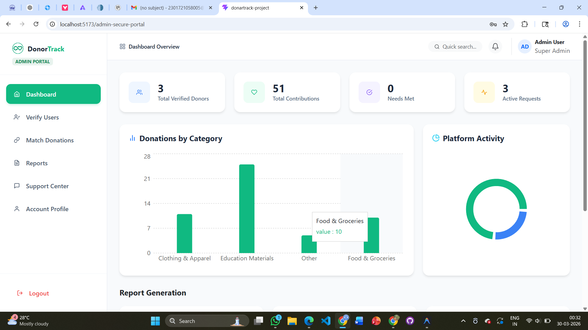

# 🎯 DonationTrack

A modern donation management platform that connects **donors** with **beneficiaries** through an intelligent matching system. DonationTrack streamlines the donation process, allowing donors to contribute essential items while beneficiaries can request and track assistance in real time.

---

## 🚀 Features

### 👤 User Module
- User Registration & Login
- Donor & Beneficiary Portals
- Profile Management
- Secure Authentication

### 🎁 Donor Module
- Donate Essential Items
- View Donation History
- Track Donation Status
- Community Requests
- Auto Matching System

### 🤝 Beneficiary Module
- Request Essential Items
- Track Request Status
- View Matched Donors
- Rate Donation Experience
- Submit Feedback

### 🛠 Admin Module
- Admin Dashboard
- Verify Users
- Match Donations
- Reports & Analytics
- Support Center
- Account Profile

---

# 🛠 Tech Stack

- React.js
- Vite
- JavaScript
- HTML5
- CSS3
- Supabase
- Git & GitHub

---

# 📸 Project Screenshots

## 🏠 Home Page


---

## 🔐 Login


---

## 📝 Registration


---

## 👤 Donor Dashboard


---

## 🤝 Community Requests


---

## 📦 Donation Tracking


---

## ❤️ Beneficiary Dashboard


---

## 📍 Beneficiary Tracking


---

## 🔗 Matched Users


---

## 💬 Support


---

## 🛡 Admin Dashboard



---

## 📊 Reports


---

## 🎧 Admin Support


---

## 👨‍💼 Admin Profile


---

# ⚙ Installation

```bash
git clone https://github.com/hema191205-cloud/DonationTrack.git
```

```bash
cd DonationTrack
```

```bash
npm install
```

```bash
npm run dev
```

---

# 📂 Project Structure

```
DonationTrack/
│
├── screenshots/
├── src/
├── public/
├── package.json
├── README.md
└── vite.config.js
```

---

# 🔮 Future Enhancements

- AI-based Smart Matching
- Email Notifications
- QR Code Verification
- NGO Integration
- Mobile Application
- Location-based Recommendations
- Analytics Dashboard
- Multi-language Support

---

# 👩‍💻 Author

**Hemalatha B**

B.Sc Computer Science Student

---

## ⭐ Support

If you like this project, consider giving it a ⭐ on GitHub.

